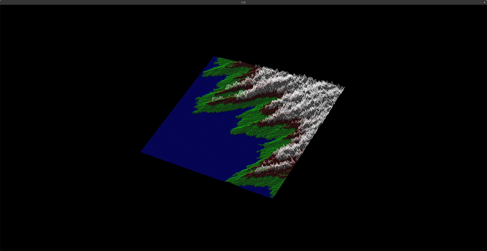
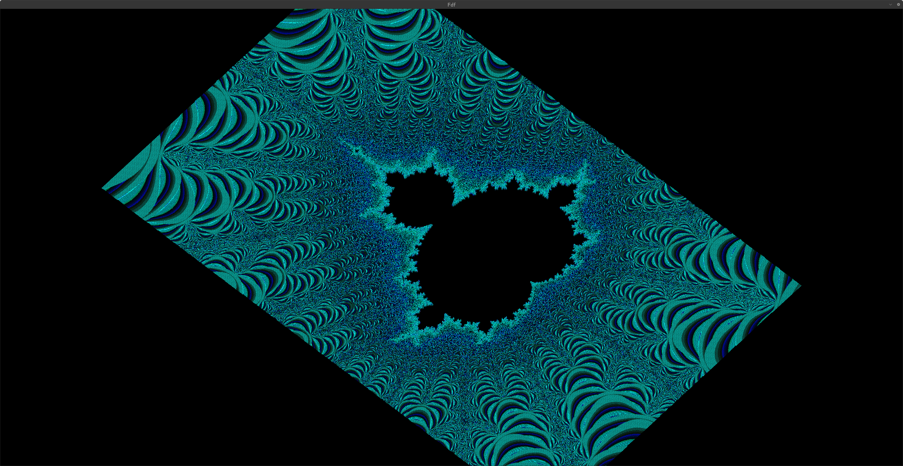
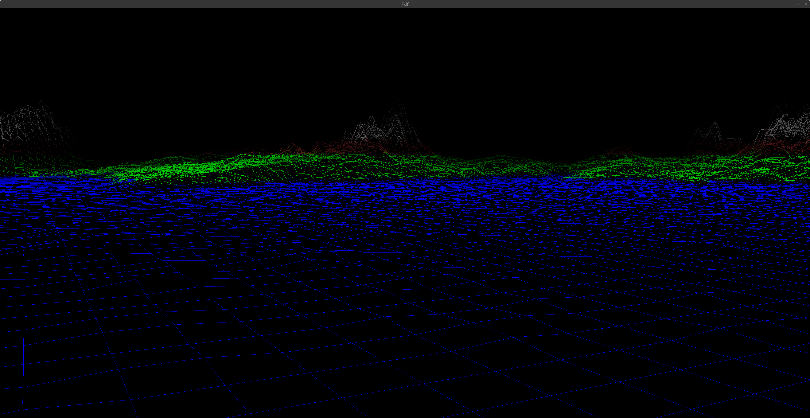
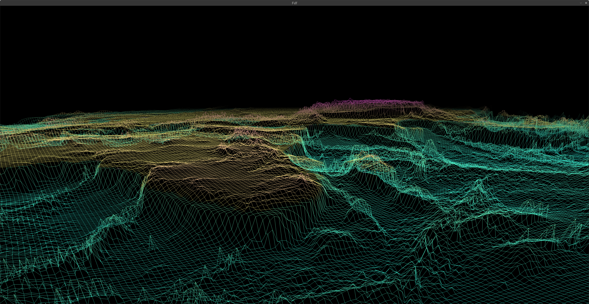

<h1 align="center">FDF - A wire frame model</h1>

<p align="center"><b><i>A simplified 3D graphic representation of a landscape.</i></b><br></p>


Need install on Linux :
```Linux
sudo apt-get install gcc make xorg libxext-dev libbsd-dev
```

To clone the project :
```bash
git clone --recursive https://github.com/hle-hena/fdf.git
cd fdf
```

To compile the program :
```bash
$ make && make clean
```


FDF is, as shown bellow, supposed to be a simple map renderer ...
<p align="center">
	
	
</p>
However, I had a bit of fun, and got a bit carried away, and created a first person render !
<p align="center">
	
	
</p>


## BINDINGS

|KEY|ACTION|
|---|---|
|`Mouse Scroll`| Zomm In/Out|
|`WASD`| Movement|
|`Mouse (Right Clicked)`| Rotation when in perspective|
|`U / J`| X axis Rotation when in isometric|
|`I / K`| Y axis Rotation when in isometric|
|`O / L`| Z axis Rotation when in isometric|
|`SPACE`| Switch between projections|
|`SHIFT`| Switch between two kinds of movement in perspective|
|`CTRL`| Switch between modes|
|`TAB`| Switch the current modifier if in CONTROL mode|
|`+ / -`| Increment or decrement the current modifier if in CONTROL mode|
|`ESC`| Quit the programm|
